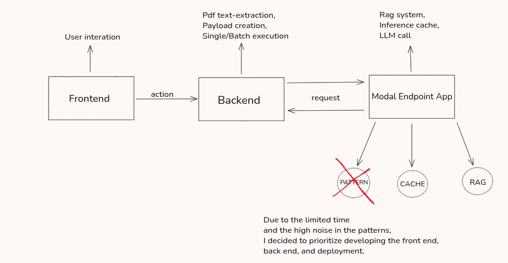

# Enter Document Parsing System


End-to-end solution to extract structured fields from PDFs from `(label, extraction_schema, pdf)` with a FastAPI backend, a Next.js UI, and an extraction/heuristics/LLM pipeline deployed via a Modal web endpoint.

---

## 1) How to run

### Docker Compose
```bash
make docker-build
make docker-up
make api_docker
# API: http://localhost:8000
# Docs: http://localhost:8000/docs   <- You can see de documentation of FastApi here
# Frontend: http://localhost:3000    <- You can acess this link to see the frontend page
```

> **Tip:** The UI allows configuring the `API Base URL`. The default is `http://localhost:8000`.


If need help with other functionalities:
```bash
make help
```

---

## 2) Configuration

### Environment variables (examples)
Create a `.env` at the project root:
```dotenv
# Edit only the "OPENAI_API_KEY" field
OPENAI_API_KEY="Insert your key here"
MODAL_EXTRACTION_URL=https://emanoelthyago3002--enter-document-parsing-system-documen-b73458.modal.run
MODAL_HEALTH_CHECK_URL=https://emanoelthyago3002--enter-document-parsing-system-health-check.modal.run
NEXT_PUBLIC_API_BASE_URL="http://localhost:8000"
WARMUP_ON_STARTUP=true
WARMUP_KIND=infer
WARMUP_INFER_LABEL=warmup
WARMUP_INFER_SCHEMA_JSON={"warmup": ""}
WARMUP_TIMEOUT_CONNECT=25
WARMUP_TIMEOUT_READ=25
```

### Pasting the evaluation data:
```bash
./ai-fellowship-data
├── data_eval/                     <-- Paste the evaluation data here, using the same structure (dataset.json and files/)
├── dataset.json
├── files
│   ├── oab_1.pdf
│   ├── oab_2.pdf
│   ├── oab_3.pdf
│   ├── tela_sistema_1.pdf
│   ├── tela_sistema_2.pdf
│   └── tela_sistema_3.pdf
└── README.md

```

---

## 3) Folder structure (summary)
```
.
├── ai-fellowship-data/            # sample and test data (dataset.json + PDFs)
├── backend/                       # FastAPI (routes, schemas, services)
├── frontend/                      # Next.js
├── modal_endpoint_app/            # pipeline/endpoint (local or Modal)
├── docker-compose.yml             # orchestrates backend + frontend
├── Makefile                       # build/run/dev shortcuts
├── .env
├── .gitignore
└── README.md
```

---

## 4) API (main routes)
> Full specification is available at **/docs** (OpenAPI) once the backend is up.

### Health
```
GET /health        → { status: "ok", ... }
```

### Extraction (single)
```
POST /infer
Body (minimal example):
{
  "label": "carteira_oab",
  "extraction_schema": {
    "nome": "Professional name",
    "inscricao": "Registration number",
    "seccional": "Section",
    "subsecao": "Subsection",
    "categoria": "Category",
    "telefone_profissional": "Phone",
    "situacao": "Status"
  },
  "pdf_path": "ai-fellowship-data/files/oab_1.pdf"
}

Response:
{
  "label": "carteira_oab",
  "pdf_path": "...",
  "extraction_schema": {
    "nome": "JOANA D'ARC",
    "inscricao": "101943",
    "seccional": "PR",
    "subsecao": "Conselho Seccional - Paraná",
    "categoria": "Suplementar",
    "telefone_profissional": null,
    "situacao": "Situação Regular"
  }
}
```

### Batch processing
Synchronous:
```
POST /batch/sync
{
  "dataset_json_path": "ai-fellowship-data/dataset.json"
}
→ returns an ordered list of processed items (each item with {file_name, item, result}).
```
Asynchronous/stream (if enabled):
```
POST /batch/async     # SSE
```
> The challenge requires serial processing and that the **first item** returns in <10s. This route was designed for that.

---

## 5) Frontend (Next.js)
- **Home**: send simple requests `(label, schema, pdf_path)` and view the output JSON.
- **Configuration**: set `API Base URL` and see the health status.
- **Batch**: runs `dataset.json` and displays items line-by-line; option to download the consolidated JSON result.
- **UX improvements**: progress bar, re-run failures, “download all” button.

---

## 6) Technical strategy (summary)


- **LLM on demand**: call LLM only for ambiguous fields (upper bound on cost).
- **Session cache**: store previous inputs/outputs for quick reuse.
- **Layout-adaptive**: simple RAG by label-retrieve the most similar prior input and bring both the input and the answer to the model.

---

## 7) Sample dataset
The repo includes `ai-fellowship-data/` with `dataset.json` and PDFs for quick development. You can point `pdf_path` directly to those files.

---

## 8) Troubleshooting
- **PDF paths**: use paths relative to the project root (or absolute) that the backend can read.
- **Ports busy**: change `PORT` in the Makefile or `ports` in `docker-compose.yml`.

---

## 9) Known Issues & Warmup System 

### Cold Start Problem

container is first started, there is a cold start delay before the first inference request can be served.
This happens because: - The container must load Python dependencies, models, and environment
variables. - The extraction pipeline (LLM/heuristics) initializes only on the first call, which increases
latency for the first user request. In practice, this means that the first `/infer` or `/batch/sync` call
after container startup may take longer than expected (≈10–20s), especially on cold deployments.

### Warmup Strategy To mitigate this, the system includes an automatic warmup routine controlled

When `WARMUP_ON_STARTUP` is enabled, the backend automatically sends a dummy inference
request to the Modal endpoint during startup. This preloads all required modules and ensures that
the first real request from the user responds quickly (<2s).

### Container Idle Timeout To avoid
unnecessary billing and keep the system responsive, the Modal container was configured with a
controlled idle timeout. If no inference is requested within a certain period, the container
automatically shuts down. On the next request, the warmup mechanism reactivates it, reducing the
cold start penalty. The default time is 30 minutes.

### Next Steps for Optimization

If time had allowed, the next step would have been to explore regex-based extraction and the positional reuse of previous answers to further accelerate inference.
The idea was to identify deterministic field patterns (e.g., registration numbers, document IDs, section names) through regular expressions and to reuse the layout or spatial context from prior successful parses.
This would have made the system progressively faster and more accurate over time, reducing the need for repeated LLM calls and improving overall throughput.